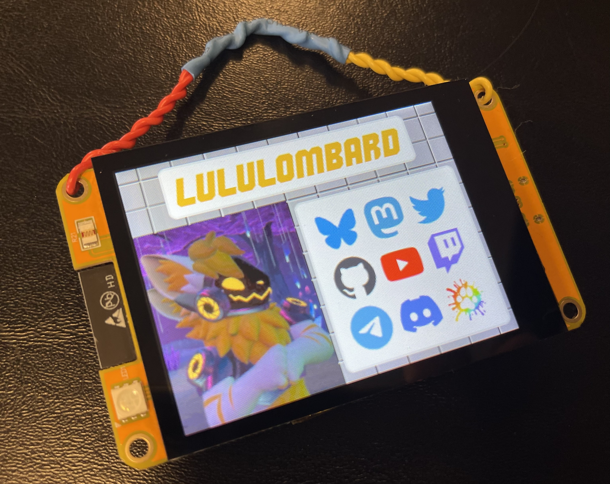
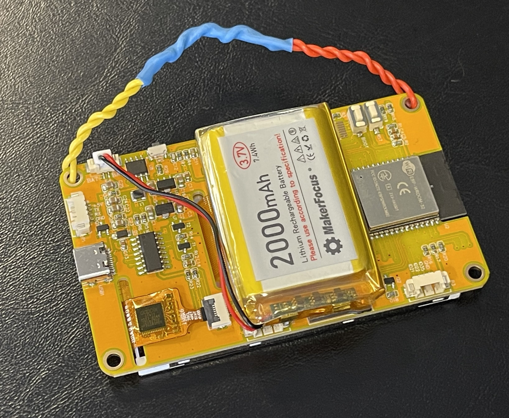

# Socials badge for ESP32 Sunton 3248S035C




For [PlatformIO](https://platformio.org/)

This is based on the [esp32-smartdisplay](https://github.com/rzeldent/esp32-smartdisplay) library that is intended to be used in [PlatformIO](https://platformio.org/).
See [https://github.com/rzeldent/esp32-smartdisplay](https://github.com/rzeldent/esp32-smartdisplay/) for more information about the driver library.

>[!WARNING]
>Do not forget to clone this repository with submodules: ```git clone --recurse-submodules```!
>This is required to also have the latest version of the [Sunton boards definitions](https://github.com/rzeldent/platformio-espressif32-sunton).

## Notes

All the UI was made with SquareLine.

If the touch display is rotated weirdly, make sure to change `TOUCH_SWAP_XY=false` to `TOUCH_SWAP_XY=true` in `boards/esp32-2432S032C.json`
